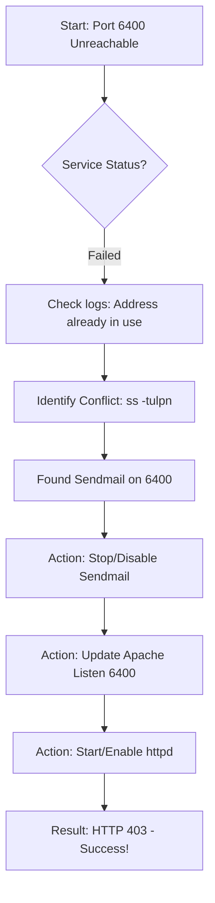

```markdown
# Incident Report: Apache Port 6400 Connectivity Fix

## 🛠 Problem Description
The Apache service on **App Server 1 (`stapp01`)** was unreachable on port **6400**.  
Initial diagnostics indicated that the service was in a `failed` state and could not bind to the network interface.

## 📊 Troubleshooting Workflow


## 🔍 Diagnostics & Discovery
I used the following Linux networking tools to identify the root cause:

1. **`systemctl status httpd`**: Confirmed the service failed to start with the specific error:  
   `(98)Address already in use: AH00072: make_sock: could not bind to address [::]:6400`
2. **`ss -tulpn`**: Identified that the `sendmail` service (PID 16207) was already listening on port 6400, preventing Apache from starting.

---

## 🚀 The Fix

### 1. Evicting the Port Conflict
To free up the port for Apache, I stopped the conflicting service and ensured it would not restart on the next boot:

```bash
# Stop and disable the conflicting service
sudo systemctl stop sendmail
sudo systemctl disable sendmail

# Force kill the process if it remains active
sudo kill -9 16207
```

### 2. Securing with Firewall (iptables)
Instead of disabling the firewall (which would compromise security), I added a specific rule to allow traffic on port 6400 while keeping the system protected.

**File:** `/etc/sysconfig/iptables`  
**Change:** Added the following line **above** the global `REJECT` rules:

```text
-A INPUT -p tcp -m state --state NEW -m tcp --dport 6400 -j ACCEPT
```

### 3. Service Persistence
Finally, I restarted and enabled the required services to ensure the fix survives a system reboot:

```bash
sudo systemctl restart iptables && sudo systemctl enable iptables
sudo systemctl start httpd && sudo systemctl enable httpd
```

---

## 💡 Key Lessons Learned

* **Port Ownership**: Always check `ss` or `netstat` first. Multiple services cannot bind to the same IP/Port combination simultaneously.
* **Firewall Persistence**: Disabling a firewall is a "quick fix" but not a professional one. Real-world DevOps requires writing granular rules.
* **Syntax Matters**: `iptables` requires a blank newline at the end of the configuration file to parse correctly.
* **Fleet Health**: In a cluster environment, checking one node is not enough. Always verify connectivity across the entire fleet (`stapp01`, `stapp02`, `stapp03`) before finalizing a task.
```

